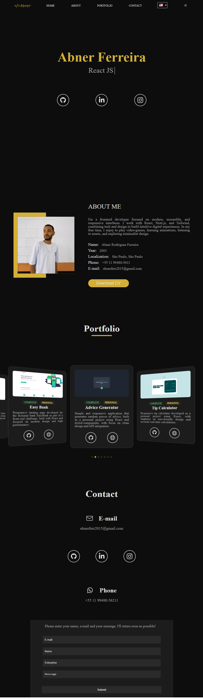

# 👨‍💻 Portfolio Abner

**Portfolio Abner** is a personal portfolio website built with **ReactJS** and **Tailwind CSS**, designed to showcase my skills, projects, and professional experience as a frontend developer. The site offers a clean and responsive design, ensuring an optimal viewing experience across various devices.

## 📸 Project Preview

  

## 🚀 Project Overview

The portfolio includes:

- **Home Section**: Introduction and brief overview.
- **About Section**: Detailed information about my background and skills.
- **Projects Section**: Showcases selected projects with descriptions and links.
- **Contact Section**: Provides a contact form and social media links for easy communication.

## 🌟 Features

- 🎯 **Responsive Design**  
  Ensures seamless experience on mobile, tablet, and desktop devices.

- 🧭 **Smooth Navigation**  
  Enables easy access to different sections of the portfolio.

- 🧩 **Interactive Components**  
  Engages visitors with interactive UI elements.

- 🎨 **Clean Aesthetic**  
  Utilizes Tailwind CSS for a modern and minimalist design.

## 🛠️ Technologies Used

- **ReactJS** – JavaScript library for building user interfaces.
- **Tailwind CSS** – Utility-first CSS framework for rapid UI development.
- **React Router** – Handles navigation between different sections.
- **Vite** – Next-generation frontend build tool for fast development.

## 📚 Learning Objectives

This project was developed to:

- Demonstrate proficiency in ReactJS and Tailwind CSS.
- Showcase personal projects and professional experience.
- Practice responsive design and user-friendly UI/UX principles.

## 🌐 Live Demo

Experience the live portfolio here:  
👉 [portfolio-abner.vercel.app](https://portfolio-abner.vercel.app/#home)

## 📄 License

This project is intended for personal branding and demonstrative purposes.  
All content and functionalities are original and tailored to represent my professional profile.

---